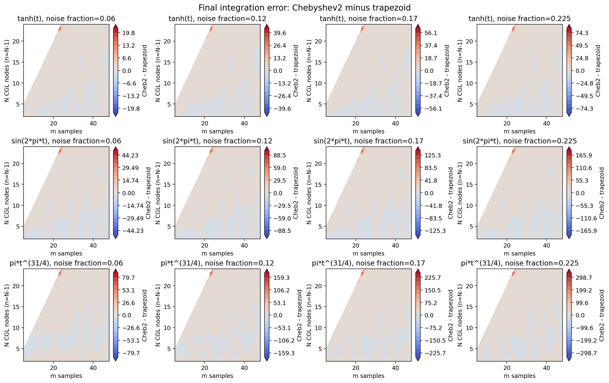
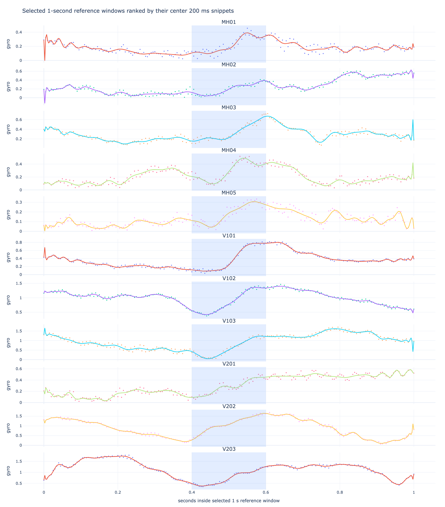

# Executive Summary

The evidence supports a conditional, not universal, case for Chebyshev2 quadrature. The corrected Chebyshev2 integration path now evaluates the antiderivative in an `N+1` representation, and the regularized runs use the derivative-matrix Tikhonov term with `lambda1 = 0.005`. Those fixes make the comparison fairer, but they do not make Chebyshev2 dominate trapezoid integration in every regime.

The consistent pattern is:

- Chebyshev2 is strongest when the signal is smooth and the chosen `N` is modest, usually near or below `sqrt(m)`.
- Trapezoid remains a strong baseline because the samples are uniformly spaced and the data are noisy. It is local and less exposed to global fit artifacts.
- Tikhonov regularization helps most when the Chebyshev2 fit would otherwise use too much high-order freedom. It can improve robustness, but it is still a modeling choice rather than a guaranteed win.
- The EuRoC snippets are the most relevant evidence. They show that Chebyshev2 can win on aggressive 200 ms windows, but the advantage depends on `N`, noise level, and dataset.

Summary over the decision-view comparisons:

| Family                           | lambda1 | Overall RMSE win rate | Median RMSE advantage | Mean robust-N win rate | Robust rows with positive advantage |
| -------------------------------- | ------- | --------------------- | --------------------- | ---------------------- | ----------------------------------- |
| analytic scalar functions        | 0       | 63%                   | 0.0001375             | 85%                    | 100%                                |
| analytic scalar functions        | 0.005   | 65%                   | 0.0001984             | 88%                    | 100%                                |
| random degree-4 polynomials      | 0       | 58%                   | 5.902e-05             | 100%                   | 100%                                |
| random degree-4 polynomials      | 0.005   | 61%                   | 7.695e-05             | 96%                    | 100%                                |
| EuRoC aggressive 200 ms snippets | 0       | 38%                   | -2.246e-05            | 68%                    | 87%                                 |
| EuRoC aggressive 200 ms snippets | 0.005   | 46%                   | -9.268e-06            | 71%                    | 95%                                 |

How to read the figures: positive advantage means `trapezoid error - Chebyshev2 error > 0`, so Chebyshev2 has lower error. The black diamond marks the best median RMSE `N`, and the dashed vertical line marks `sqrt(m)`.

# Reproducing the May 24 Scalar Comparison

The May 24 scalar notebook can be reproduced with the current corrected integration code. The two figures below are deliberately representative old-style image plots: they establish continuity with Benjamin's original scalar comparison, but they are not the best way to choose `N` because the sign, noise dependence, and fixed-`N` slices are hard to compare directly.

{width=100%}

{width=100%}

# Decision-oriented analytic scalar views

The same three analytic functions are now shown through the decision-oriented Plotly exports. The unregularized block is the baseline; the regularized block uses lambda1 = 0.005. Positive RMSE advantage means trapezoid error minus Chebyshev2 error is positive, so Chebyshev2 is better.

## No Tikhonov (`lambda1 = 0`)

### `tanh(t)`

{width=100%}

{width=100%}

### `sin(2*pi*t)`

{width=100%}

{width=100%}

### `pi*t^(31/4)`

{width=100%}

{width=100%}

## Tikhonov (`lambda1 = 0.005`)

### `tanh(t)`

{width=100%}

{width=100%}

### `sin(2*pi*t)`

{width=100%}

{width=100%}

### `pi*t^(31/4)`

{width=100%}

{width=100%}

# Random Degree-4 Polynomials

The random-polynomial notebook broadens the scalar comparison beyond the three hand-picked analytic functions. Each degree-4 polynomial is defined by fixed random values at five CGL nodes on `[0, 1]`; the same Monte Carlo grid is then used for no Tikhonov and for `lambda1 = 0.005`.

| Function                     | f(0.000) | f(0.146) | f(0.500) | f(0.854) | f(1.000) |
| ---------------------------- | -------- | -------- | -------- | -------- | -------- |
| random degree-4 polynomial 1 | -0.1211  | 0.3145   | 0.1258   | 0.4067   | -0.3488  |
| random degree-4 polynomial 2 | -0.1641  | -0.0227  | 0.0029   | -0.1796  | 0.199    |
| random degree-4 polynomial 3 | -0.4065  | 0.4601   | -0.2177  | 0.1236   | 0.423    |

## No Tikhonov (`lambda1 = 0`)

### `random degree-4 polynomial 1`

{width=100%}

{width=100%}

### `random degree-4 polynomial 2`

{width=100%}

{width=100%}

### `random degree-4 polynomial 3`

{width=100%}

{width=100%}

## Tikhonov (`lambda1 = 0.005`)

### `random degree-4 polynomial 1`

{width=100%}

{width=100%}

### `random degree-4 polynomial 2`

{width=100%}

{width=100%}

### `random degree-4 polynomial 3`

{width=100%}

{width=100%}

# EuRoC Aggressive 200 ms Snippets

The EuRoC extension changes the question from synthetic scalar functions to IMU-like signals. For each merged EuRoC CSV, the workflow fits one-second `gyro_norm` windows with Chebyshev2 using `N = 50`. It then scores only the center interval `[0.4, 0.6]` with the local aggressive-window diagnostic, so the selected window is aggressive in the 200 ms interval actually used by the quadrature comparison. The resulting CGL node values define the reference scalar function; the Monte Carlo comparison samples only that middle 200 ms interval.

The figure below shows all selected snippets. Points are the raw uniformly sampled IMU values in the selected one-second window, the line is the `N = 50` Chebyshev2 reference fit, and the shaded region is the 200 ms interval used for quadrature.

{width=100%}

Selection metadata:

| dataset | window | snippet_s | score | activity | high_ratio | nRMSE   |
| ------- | ------ | --------- | ----- | -------- | ---------- | ------- |
| V101    | 23     | 23.4-23.6 | 13.87 | 1.621    | 0.8876     | 0.1391  |
| V103    | 68     | 68.4-68.6 | 9.266 | 0.8771   | 0.8588     | 0.1117  |
| V102    | 69     | 69.4-69.6 | 8.143 | 0.929    | 0.7507     | 0.07532 |
| MH02    | 53     | 53.4-53.6 | 7.924 | 1.2      | 0.8361     | 0.2954  |
| MH03    | 45     | 45.4-45.6 | 7.782 | 0.9836   | 0.7857     | 0.1817  |
| MH04    | 49     | 49.4-49.6 | 6.888 | 1.038    | 0.7596     | 0.2433  |
| V202    | 54     | 54.4-54.6 | 6.555 | 0.9056   | 0.7245     | 0.06962 |
| V201    | 85     | 85.4-85.6 | 6.465 | 0.7833   | 0.7612     | 0.1882  |
| MH01    | 38     | 38.4-38.6 | 6.373 | 1.017    | 0.7885     | 0.3344  |
| MH05    | 16     | 16.4-16.6 | 6.302 | 0.9104   | 0.7986     | 0.2625  |
| V203    | 73     | 73.4-73.6 | 5.435 | 0.6895   | 0.7481     | 0.06814 |

# EuRoC Decision-oriented Views

The following pages show the same decision views for every selected EuRoC snippet, first without Tikhonov and then with `lambda1 = 0.005`.

## No Tikhonov (`lambda1 = 0`)

### `MH01 center-200ms aggressive gyro_norm`

{width=100%}

{width=100%}

### `MH02 center-200ms aggressive gyro_norm`

{width=100%}

{width=100%}

### `MH03 center-200ms aggressive gyro_norm`

{width=100%}

{width=100%}

### `MH04 center-200ms aggressive gyro_norm`

{width=100%}

{width=100%}

### `MH05 center-200ms aggressive gyro_norm`

{width=100%}

{width=100%}

### `V101 center-200ms aggressive gyro_norm`

{width=100%}

{width=100%}

### `V102 center-200ms aggressive gyro_norm`

{width=100%}

{width=100%}

### `V103 center-200ms aggressive gyro_norm`

{width=100%}

{width=100%}

### `V201 center-200ms aggressive gyro_norm`

{width=100%}

{width=100%}

### `V202 center-200ms aggressive gyro_norm`

{width=100%}

{width=100%}

### `V203 center-200ms aggressive gyro_norm`

{width=100%}

{width=100%}

## Tikhonov (`lambda1 = 0.005`)

### `MH01 center-200ms aggressive gyro_norm`

{width=100%}

{width=100%}

### `MH02 center-200ms aggressive gyro_norm`

{width=100%}

{width=100%}

### `MH03 center-200ms aggressive gyro_norm`

{width=100%}

{width=100%}

### `MH04 center-200ms aggressive gyro_norm`

{width=100%}

{width=100%}

### `MH05 center-200ms aggressive gyro_norm`

{width=100%}

{width=100%}

### `V101 center-200ms aggressive gyro_norm`

{width=100%}

{width=100%}

### `V102 center-200ms aggressive gyro_norm`

{width=100%}

{width=100%}

### `V103 center-200ms aggressive gyro_norm`

{width=100%}

{width=100%}

### `V201 center-200ms aggressive gyro_norm`

{width=100%}

{width=100%}

### `V202 center-200ms aggressive gyro_norm`

{width=100%}

{width=100%}

### `V203 center-200ms aggressive gyro_norm`

{width=100%}

{width=100%}
